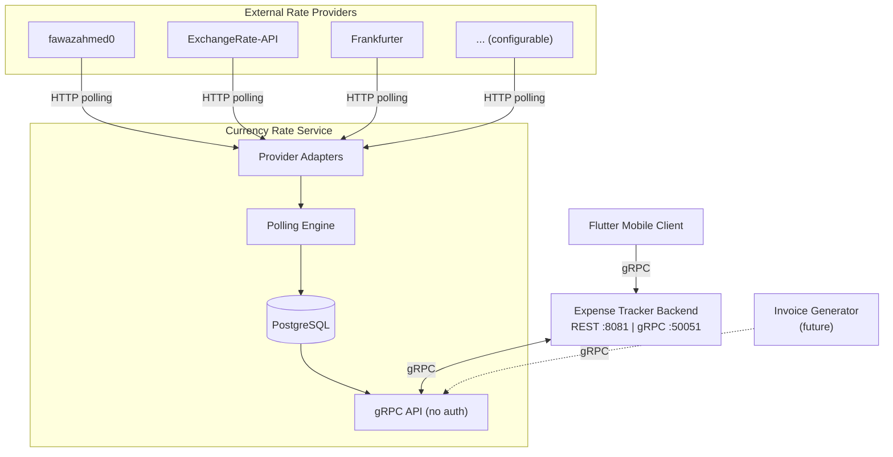

# Currency Rate Service - Business Requirements Document

# 1. Document Overview
- **Document Owner:** Igor Kudinov — Business & System Analyst
- **Date / Version:** March 2026 / v1.0
- **Related Initiatives / Projects:** Expense Tracker Ecosystem, Invoice Generator (future), Microservice Architecture Migration
- **Main Stakeholders:** Project Owner (BSA/Developer), Expense Tracker Backend (primary consumer), Invoice Generator (future consumer)

---

# 2. Executive Summary

**Currency Rate Service** is an autonomous microservice that provides live and historical currency exchange rates to applications within the Expense Tracker ecosystem. The service addresses the multi-currency support requirement identified in the Expense Tracker BRD (BR-5) and serves as the first inter-service communication component in the evolving microservice architecture.

The primary problem being solved is the absence of a centralized currency rate source. The Expense Tracker currently supports transactions in multiple currencies but offers no conversion or equivalent display — users rely on mental estimates when reviewing multi-currency financial data. Each future application in the ecosystem (e.g., Invoice Generator) would face the same integration challenge independently, leading to duplicated effort and inconsistent rate data.

The service will periodically collect exchange rates from configurable external providers, persist them in a dedicated database, and expose current and historical rates via a gRPC API accessible without authentication. The initial release targets three fiat currency pairs (RSD↔EUR, RSD↔USD, EUR↔USD), with the architecture designed to support cryptocurrency rates (USDT, USDC, BTC, ETH) in future iterations. Through v1.0, the service is informational only — rates are approximate and not intended for financial-grade calculations.

---

# 3. Business Context

## 3.1 General Business Goal

Enable multi-currency financial visibility across the Expense Tracker ecosystem by providing a centralized, reliable source of current and historical exchange rates. Establish the foundation for inter-service communication as the system evolves from a monolithic application toward a microservice architecture.

## 3.2 Problem or Opportunity Being Addressed

**Core Problem:**
The Expense Tracker BRD (BR-5) defines multi-currency support as a requirement: transactions are recorded in RSD and EUR, but the system provides no mechanism for displaying currency equivalents. Users currently rely on mental estimates when comparing transactions across currencies, which undermines the goal of data-driven financial decision-making.

**Expanded Currency Scope:**
Beyond the original BRD scope (RSD, EUR), USD is added as the third fiat currency to reflect real financial needs — international purchases and savings diversification. The initial release covers three pairs: RSD↔EUR, RSD↔USD, EUR↔USD.

**Ecosystem Opportunity:**
Without a centralized rate source, each application in the ecosystem (Expense Tracker, Invoice Generator, future services) would need to independently integrate with external exchange rate APIs. This leads to duplicated development effort, inconsistent rate data across applications, and no historical rate accumulation.

**Future Expansion:**
Growing cryptocurrency adoption creates an opportunity to extend the service with crypto rate support (USDT, USDC, BTC, ETH) in future iterations, providing a unified rate source for both fiat and digital currencies.

## 3.3 Market or Regulatory Factors

- **Multi-currency environment:** Serbia operates primarily in RSD with EUR widely used for larger transactions, real estate, and cross-border payments. USD is relevant for international purchases and investment contexts
- **Exchange rate volatility:** RSD is subject to periodic fluctuations against EUR and USD, making fresh rate data essential for meaningful financial visibility
- **Cryptocurrency adoption:** Stablecoins (USDT, USDC) are increasingly used for practical financial operations; BTC and ETH are relevant as investment assets — all require rate tracking against fiat currencies
- **No regulatory requirements:** The service handles publicly available exchange rate data for personal informational use. No financial licensing, compliance, or data protection regulations apply

## 3.4 Impact on Existing Processes, Teams, or Systems

- **Expense Tracker Backend:** Will integrate as a gRPC client to display currency equivalents alongside transactions. This is the primary consumer and the first inter-service dependency in the ecosystem
- **Flutter Mobile Client:** Benefits indirectly — enriched transaction data with currency equivalents will be served via the Expense Tracker Backend
- **Invoice Generator (future):** Will consume the service directly for EUR↔RSD conversion in international invoices
- **Infrastructure:** Introduces a new Docker container and a dedicated PostgreSQL database on the existing Hetzner VPS. Increases operational scope (monitoring, maintenance) but within the existing infrastructure
- **Development workflow:** Establishes patterns for future microservices — separate repository, independent deployment lifecycle, proto-based API contract, inter-service gRPC communication

---

# 4. Objectives and Goals

| Goal | KPI / Metric | Expected Benefit | Priority |
|------|---------------|------------------|-----------|
| Deliver a working rate collection service for 3 fiat currency pairs (RSD↔EUR, RSD↔USD, EUR↔USD) | Service deployed and returning current rates for all 3 pairs | Centralized rate source available for ecosystem consumption | High |
| Provide gRPC API consumable by Expense Tracker Backend | Expense Tracker successfully retrieves rates via gRPC; response time <50ms | Multi-currency equivalents displayed alongside transactions | High |
| Achieve reliable rate freshness | >95% of polling cycles succeed within configured interval; rate age never exceeds 2× polling interval without staleness flag | Users always see either a fresh rate or an explicitly flagged outdated rate — never a silently stale value | High |
| Accumulate historical exchange rate data from day one | Continuous historical records stored per pair per polling cycle | Foundation for future trend analysis, rate charts, and volatility insights | Medium |
| Support extensible provider architecture | New standard REST JSON provider addable via configuration only (no code changes) | Reduced effort to add or replace rate sources; resilience through provider diversity | Medium |

---

# 5. Stakeholders

| Name | Department / Role | Responsibility / Interest | Influence |
|------|--------------------|---------------------------|------------|
| **Human Stakeholders** | | | |
| Igor Kudinov | Project Owner / BSA / Developer | Project leadership, requirements definition, system design, implementation, and maintenance | High |
| Igor Kudinov (User) | Primary User / Family Financial Manager | Benefits from currency equivalents in Expense Tracker; validates rate accuracy against real-world experience | Medium |
| Wife | Primary User / Family Financial Manager | Benefits from currency equivalents in Expense Tracker UI; no direct interaction with the service | Medium |
| **System Consumers** | | | |
| Expense Tracker Backend | Primary consumer (gRPC client) | Retrieves current rates for multi-currency transaction display; depends on service availability and rate freshness | High |
| Invoice Generator | Future consumer (gRPC client) | Will consume EUR↔RSD rates for international invoice conversion; depends on API contract stability | Low |

---

# 6. Current State (As-Is)

## 6.1 Currency Handling in Expense Tracker

The Expense Tracker supports multi-currency transactions at the data level but lacks any conversion or rate display capability:

- Transactions are recorded in RSD or EUR (enforced by CHECK constraint in the database schema)
- Accounts have a currency field limited to RSD or EUR (SRS 2.1.5)
- The `exchange_rates` table exists in the database schema but is not populated — it was designed as a placeholder for future rate integration
- The SRS sequence diagrams reference an "External Currency API" call during transaction creation, but no implementation exists
- USD is not currently supported in the Expense Tracker schema — adding it will require extending CHECK constraints on accounts and transactions
- Users mentally estimate currency equivalents when reviewing multi-currency financial data

## 6.2 Rate Data Sources

No centralized rate storage or automated collection exists in the ecosystem. Multiple free external APIs are available (fawazahmed0, ExchangeRate-API, Frankfurter, and others), but none have been integrated. Notably, not all providers support RSD — for example, Frankfurter tracks only currencies published by the European Central Bank, which excludes the Serbian Dinar.

## 6.3 Key Pain Points

- No visibility into RSD↔EUR equivalents when reviewing transactions — the most common cross-currency scenario for the family
- No RSD↔USD or EUR↔USD rate information available anywhere in the system
- No historical rate data — impossible to analyze how exchange rate changes affected past financial decisions
- Each future application (Invoice Generator, etc.) would need to independently integrate with external rate APIs, duplicating development effort and producing inconsistent rate data
- No architectural foundation for extending to cryptocurrency rates in the future

---

# 7. Future State (To-Be)

## 7.1 Key Business Changes Expected

- Centralized exchange rate source available to any application in the ecosystem via gRPC — no application needs to integrate with external rate APIs directly
- Automated rate collection from configurable external providers on a scheduled basis, with no manual intervention required
- Historical rate data accumulated from day one of service operation, enabling future trend analysis and rate volatility insights
- Expense Tracker displays approximate currency equivalents alongside multi-currency transactions, fulfilling BRD requirement BR-5
- Architecture ready to extend to cryptocurrency rates without changes to the core service design

## 7.2 Improvements or Efficiencies Gained

- **Zero manual effort:** Rate lookup is fully automated — users no longer need to mentally estimate currency equivalents
- **Single integration point:** All current and future services consume rates from one source, eliminating duplicated external API integrations and ensuring rate consistency across the ecosystem
- **Rate data ownership:** The service maintains its own database of rates. Consumer applications query the service, not external APIs — reducing external dependency at request time and enabling offline-resilient rate access from the local database

## 7.3 Dependencies or Integrations Required

| Dependency | Type | Description |
|------------|------|-------------|
| External rate providers | External APIs | At least two providers required per currency pair (primary + backup). Candidates: fawazahmed0, ExchangeRate-API, Frankfurter (EUR pairs only) |
| Expense Tracker Backend | Internal consumer | gRPC client integration — will call GetRate/GetRates on transaction display. Requires proto contract agreement |
| PostgreSQL | Infrastructure | Dedicated database for rate storage (current + historical). Hosted on the same Proxmox server (dev) and Hetzner VPS (demo) |
| Hetzner VPS | Infrastructure | Deployment target — new Docker container alongside existing Expense Tracker stack |
| Cloudflare DNS | Infrastructure | DNS record for the service (if HTTP health endpoint exposed publicly) |

## 7.4 Architecture Context

> This diagram reflects the business-level service topology. Technical details (ports, protocols, deployment configuration) are specified in the SRS.

---

# 8. Business Requirements

| ID | Requirement | Description | Priority | Acceptance Criteria |
|----|--------------|-------------|-----------|----------------------|
| BR-1 | Automated Rate Collection | The service must automatically collect exchange rates from external providers on a configurable schedule | High | Rates for all configured currency pairs are polled and stored at the defined interval without manual intervention |
| BR-2 | Provider Failover | The service must support primary and backup rate providers per currency pair with automatic failover | High | If the primary provider fails, the service retrieves rates from the backup provider within the same polling cycle |
| BR-3 | Rate Storage and History | The service must persist current and historical exchange rates in a dedicated database | High | Current rates are queryable in real time; historical rates are retained and queryable by date range |
| BR-4 | gRPC Rate API | The service must expose exchange rates via a gRPC API accessible by any consumer without authentication | High | Consumers can retrieve current rates, batch rates, and the list of supported pairs via gRPC |
| BR-5 | Staleness Indication | The service must mark a rate as outdated if a polling cycle fails for both primary and backup providers — the last known rate remains available but flagged, and the consuming application decides how to handle it | High | When both providers fail, the stored rate receives an outdated flag; the API returns the last known rate with staleness metadata; consumers can distinguish fresh rates from outdated ones |
| BR-6 | Extensible Provider Architecture | The service must support adding new rate providers through configuration for standard REST JSON APIs, and through code for non-standard sources | Medium | A new standard provider can be added via configuration without code changes; non-standard providers are addable via a defined adapter interface |
| BR-7 | Configurable Currency Pairs | The service must support a configurable set of currency pairs, not limited to hardcoded values. v1 scope: RSD↔EUR, RSD↔USD, EUR↔USD | Medium | Currency pairs are defined in the database; adding a new pair requires only a database update without service restart |
| BR-8 | Provider Health Monitoring | The service must track and report the health status of each configured provider | Medium | Per-provider health data is available: last success/failure timestamp, consecutive failure count, current status |
| BR-9 | Service Observability | The service must provide health check endpoints, structured logging, and operational metrics | Medium | Health endpoint returns service status; logs are structured (JSON); key metrics (polling success rate, response latency) are available |
| BR-10 | Autonomous Operation | The service must operate independently — its availability must not depend on the Expense Tracker or any other consumer | Medium | Service starts, polls, and stores rates regardless of whether any consumer is connected or operational |
| BR-11 | [POST-v1] Cryptocurrency Rates | The service must be architecturally capable of supporting cryptocurrency rate pairs (USDT, USDC, BTC, ETH) in future iterations | Low | Provider adapter interface and data model do not impose fiat-only constraints; crypto pairs can be added without architectural changes |
| BR-12 | Database-Driven Configuration | The service must manage business configuration (currency pairs, providers, polling intervals, primary/backup assignments) through the database, not configuration files. Only system-level settings (server port, database connection, log level) reside in config files | Medium | Adding a new currency pair or changing a provider assignment requires only a database update, not a config file change or service restart |

---

# 9. Functional and Non-Functional Needs

## 9.1 Functional Needs

The following areas require detailed specification in the SRS:

- **Polling engine:** Scheduled rate collection with per-pair configurable intervals, retry logic, and staleness flag management
- **Provider adapter system:** Hybrid architecture — generic JSON adapter for standard REST APIs (URL template + JSONPath) and custom adapter interface for non-standard sources
- **Rate storage and retrieval:** Current rates with staleness metadata, historical rate accumulation, database-driven configuration for pairs and providers
- **gRPC API:** Methods for rate retrieval — GetRate (single pair), GetRates (batch), ListSupportedPairs; GetRateHistory (historical data, may be deferred to v2)
- **Provider health tracking:** Per-provider status (last success, last failure, consecutive failures), used for failover decisions and operational monitoring
- **Graceful degradation:** When providers are unavailable — staleness flags on stored rates, continued serving of last known data with metadata

## 9.2 Non-Functional Needs

The following constraints and expectations require detailed specification in the SRS:

- **Performance:** gRPC response time <50ms for current rate queries (served from local database, not external API)
- **Availability:** Autonomous operation — service must start, poll, and serve rates independently of any consumer's availability
- **Scalability:** Support for N currency pairs without architectural changes; adding pairs is a database configuration operation
- **Security:** No authentication required for rate queries (public data); TLS encryption required for production deployment
- **Observability:** Structured logging (JSON format), health check endpoint, key operational metrics (polling success rate, provider availability, response latency)
- **Deployment:** Standalone Docker container with independent build and release lifecycle from Expense Tracker; deployable on the same Hetzner VPS

---

# 10. Risks and Dependencies

| Risk | Impact | Probability | Mitigation |
|------|---------|-------------|-------------|
| External API deprecation or shutdown | High — loss of rate data source | Low | Multiple providers per pair (primary + backup); provider pool designed for easy replacement; monitor provider changelogs |
| Rate data inaccuracy from free APIs | Medium — misleading currency equivalents in consumer applications | Medium | Service is explicitly informational only (not financial-grade); staleness flag communicates data quality to consumers; multiple sources for cross-validation in future |
| Network dependency between services | Medium — Expense Tracker degraded if Currency Rate Service is unavailable | Medium | Expense Tracker must handle graceful degradation (show "rate unavailable" in UI); rates served from local DB, not real-time external calls |
| Single VPS hosting both services | High — server failure takes down entire ecosystem | Low | Docker container isolation enables independent restarts; automated backups for rate database; future mitigation: separate hosting or container orchestration |
| External provider rate limiting | Medium — polling failures during high-frequency intervals | Medium | Respect provider rate limits in polling configuration; use providers with no rate limits (fawazahmed0) as primary where possible; exponential backoff on failures |
| Scope creep before core stability | Medium — delayed delivery of working v1 | High | Strict v1 scope (3 fiat pairs, 2-3 providers); crypto support explicitly deferred to post-v1; feature requests tracked but not implemented until core is stable |
| Development timeline conflict with Expense Tracker QA (Stage 5.1) | Low — delayed delivery of either initiative | Medium | Currency Rate Service is an independent project with its own repository; can be developed in parallel without blocking Expense Tracker QA |

---

# 11. Expected Benefits and ROI

## 11.1 Qualitative Benefits

- **Multi-currency financial visibility:** Expense Tracker users see approximate currency equivalents alongside transactions, enabling more informed financial decisions without manual rate lookups
- **Historical rate accumulation:** Rate history builds from day one, creating a foundation for future trend analysis, volatility charts, and retrospective financial insights
- **Ecosystem-level architecture:** Establishes the first inter-service communication pattern via gRPC, creating a reusable blueprint for future microservices
- **Reduced integration duplication:** Any new application in the ecosystem (Invoice Generator, future tools) consumes rates from a single source instead of building its own external API integration
- **Data ownership:** Rate data is stored locally — the ecosystem is not dependent on external API availability at the moment a user requests a conversion

## 11.2 Quantitative Benefits

- **Zero manual rate lookups:** Eliminates ad-hoc mental estimation of currency equivalents when reviewing multi-currency transactions
- **Single integration point:** One service replaces N independent rate API integrations across the ecosystem — estimated saving of 1-2 development days per future consumer
- **Development cost:** Approximately 1-2 weeks for v1, after which the service is reusable by all current and future applications at no additional integration cost
- **Rate data volume:** At hourly polling for 3 pairs, the service accumulates ~26,000 historical records per year — minimal storage cost with growing analytical value over time

---

# 12. Approval and Sign-Off

| Name | Role | Date | Signature |
|------|------|------|------------|
| Igor Kudinov | Project Owner / BSA | | |

---